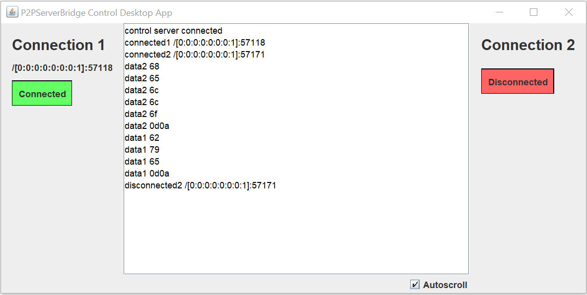

# p2p-bridge-server
Simple server to bridge peer-to-peer connections behind a firewall/NAT

Create a peer to peer connection between to devices that are behind a firewall/NAT. Both devices initiate the connection to the same server through the same port,
the server then forwards all the data one device sends, to the other and vice versa.

## Server usage
1. Build the server project or download it already built from [here](https://github.com/martialonso/p2p-bridge-server/releases/tag/1.0.0).
2. Run the `server-app` file inside the `bin` folder with the arguments: (port) (controlAppPort) (ssl)\
e.g. `./server-app 7635 7636 true` All three arguments are optional, defaults: `7635` `7636` `false`\
If ssl is true, both connections (p2p devices and control app) use ssl. Otherwise, connections are in plain text.

## Control app usage
1. Build the control app project or download it already built from [here](https://github.com/martialonso/p2p-bridge-server/releases/tag/1.0.0).
2. Run the `control-desktop-app` file inside the `bin` folder with the arguments: (host) (port) (ssl)\
e.g. `./control-desktop-app localhost 7636 true` The host argument is not optional, the other two are optional, defaults: `7636` `false`

The app shows which devices are connected and logs all the data sent between the devices.\
`data1` means the server has received data from device 1 and sent it over to device 2 (if connected). Same for `data2`.

## Usage example
Example of a situation where this could be useful _(what I personally use it for)_

Drone with Ardupilot with a phone for internet connectivity onboard.
PC with Mission Planner to receive drone telemetry.

Drone and PC are too far apart to use radio telemetry. 
Ardupilot and Mission Planner both connect to the server to simulate a peer to peer connection between Ardupilot and Mission Planner.
